# SEMANA 1
Para esta semana se entregan todos los ejercicios prácticos propuestos.

# Ejercicio 1.1: Instalación y configuración de sistemas operativos  

Este ejercicio consiste en instalar una distribución de Linux sin GUI (interfaz gráfica) en  entornos virtualizados (VirtualBox) y realizar una serie de tareas.

### 1. Asignar recursos adecuados

En primer lugar, estuve investigando para encontrar distribuciones de Linux sin GUI y me decanté por utilizar Debian para la ISO de mi máquina virtual.

Estos son los recursos que asigné a mi máquina:

1. Primero establecí el nombre de mi máquina y le asigné la ISO.
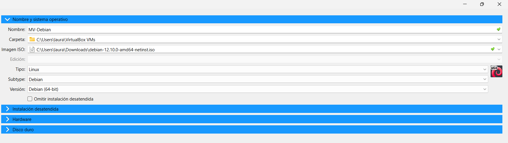

2. Después, indiqué la capacidad de memoria RAM (tampoco gran cosa ya que iba a trabajar sin GUI) y el número de procesadores de mi máquina.  
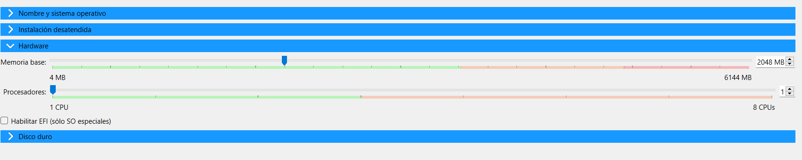

3. Finalmente, indiqué la capacidad que quiero que tenga el disco duro de mi máquina.
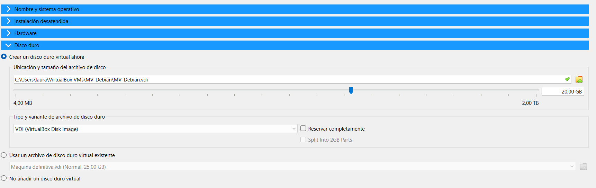

Una vez están todos los recursos asignados creé la máquina. Tras crear la máquina se debe instalar el sistema operativo. Esto llevó un rato.

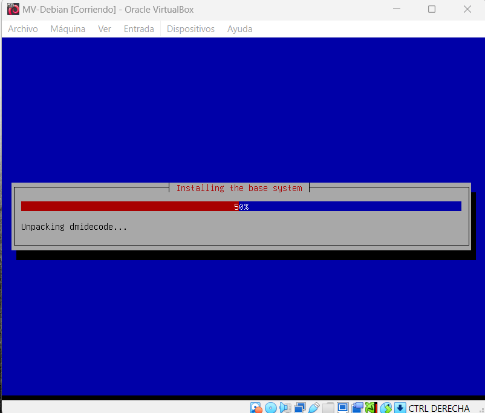

Durante la instalación debí indicar erroneamente que me instalara una interfaz gráfica. Estuve investigando como volver al punto inicial, pero la única forma que encontré para no utilizar la interfaz gráfica fue utilizar el comando `sudo apt purge gnome* gdm3 task-gnome-desktop`.

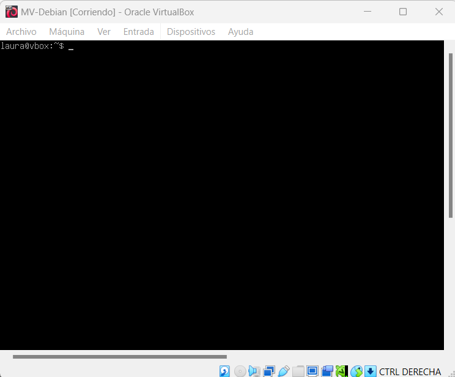

### 2. Creación de usuarios

Merece la pena destacar que todos los comandos se ejecutaron con `sudo` (modo administrador) delante para tener los permisos suficientes.

Para crear un nuevo usuario utilicé `sudo useradd` y el nombre del usuario que quise crear. Después de ejecutarlo, me pidió una contraseña además de otro datos adicionales.

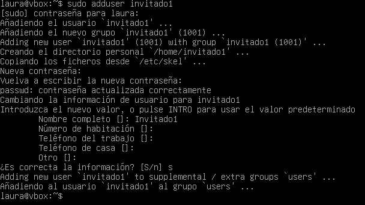

Como inciso, la creación y manejo de usuarios se puede ver mejor en el ejercicio 2.

### 3. Configurar carpetas compartidas y acceso remoto

Para llevar a cabo parte del acceso remoto, realicé los siguientes pasos:

1. Clonar la máquina virtual (para tener otra desde la que acceder remotamente a la primera que creé y evitar toda la instalación)

    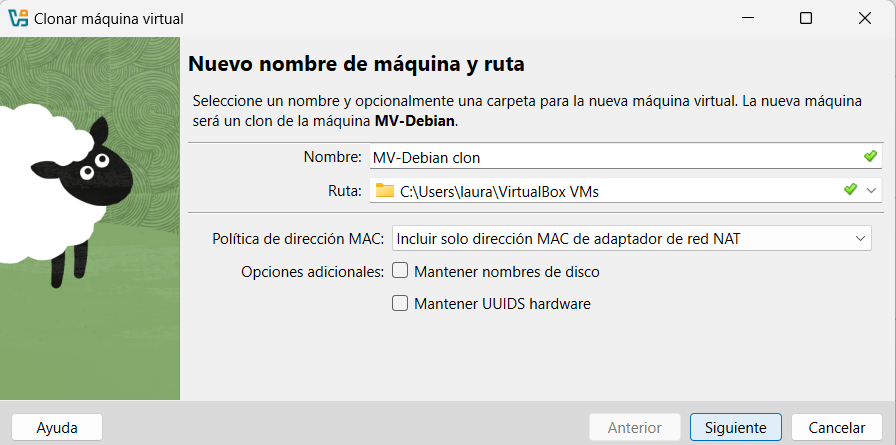

2. Establecer 2 adaptadores de red en cada máquina: una red interna llamada `compartir` para poder conectar las dos máquinas y otra que sea NAT para poder tener acceso a internet y poder descargar las heramientas que necesitamos en nuestra terminal

    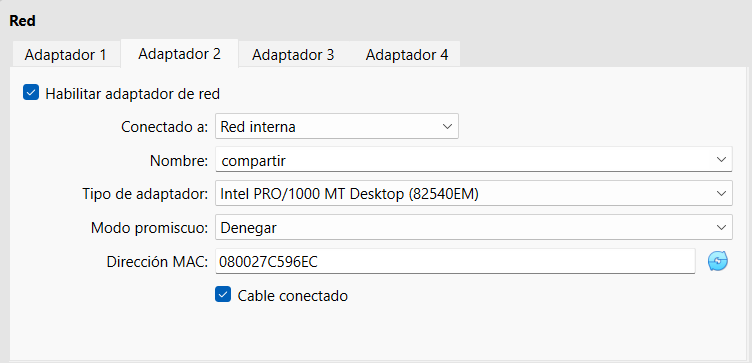
    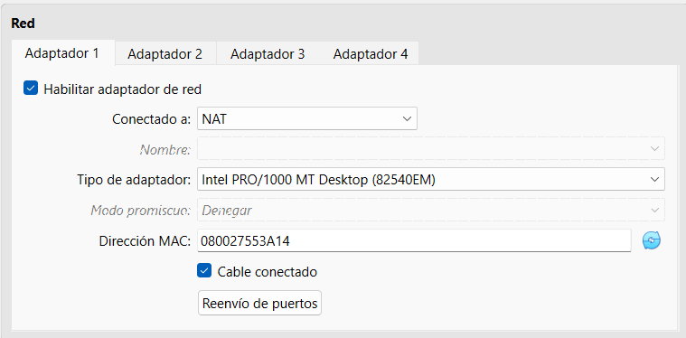

3. Asignar IP estáticas editando `/etc/network/interfaces`

    Para ello, primero reviso con `ip a` mis redes y después paso a editar el fichero con `nano`.

    VM1 (la original)
    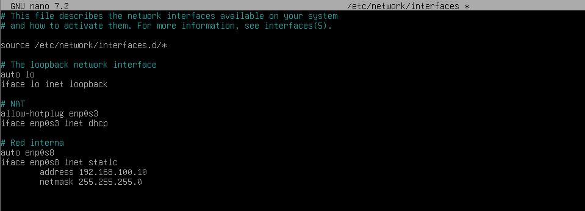

    VM2 (el clon)
    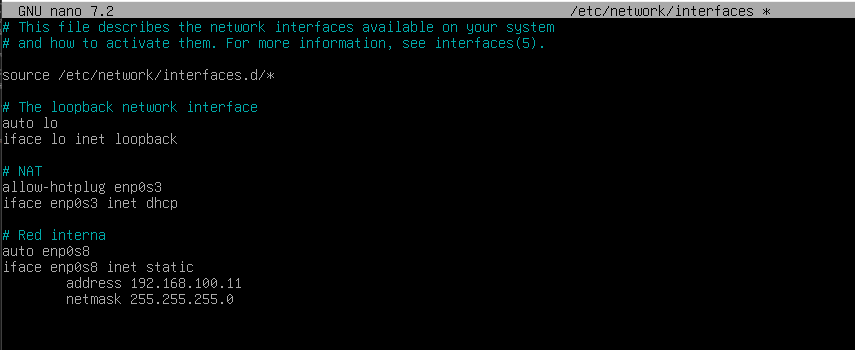

    Para aplicar los cambios, reinicié el servicio de red con `sudo systemctl restart networking` y reinicié cada máquina con `sudo reboot`.

    

4. Comprobar la conectividad con `ping`

     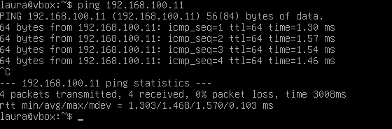

5. Instalar y habilitar SSH

    Mucho antes de este paso, al probar instalar algún que otro paquete, tuve un pequeño contratiempo porque mi red NAT tenía la IP inactiva. Para activarla utilicé el comando `sudo dhclient enp0s3` y comprobé después con `ip a`.

    
    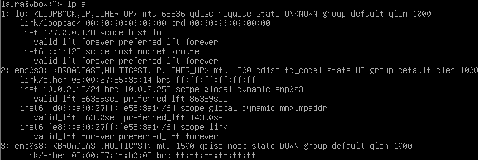

    Una vez resuelto esto, ya si pude instalar paquetes sin problema. Aunque esto lo resolví mucho antes de realizar este paso, lo dejo ilustrado aquí porque es el paso en el que se describe la descarga e instalación de algo.

    Para instalar SSH ejecuté `sudo apt  install openssh-server` y para habilitarlo `sudo systemctl enable ssh` y `sudo systemctl start ssh`.

    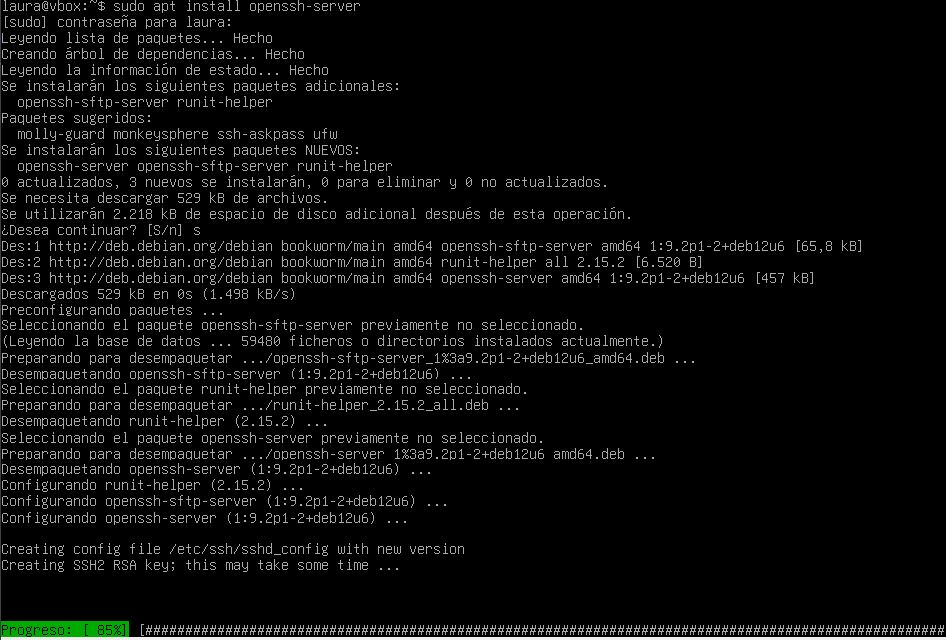
    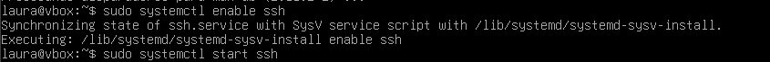

5. Conexión por SSH y creación en remoto

    Desde la máquina 1 (192.168.100.10) me conecté remotamente a la máquina 2 (192.168.100.11) y creé un directorio.

     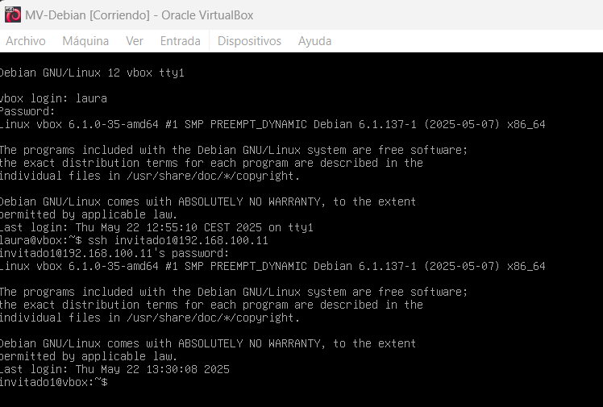

     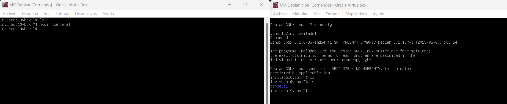
     En esta captura se puede ver a la izquierda la máquina 1, que está conectada remotamente a la máquina 2, a la derecha. En primer lugar, listé las carpetas y comprobé que no existía nada (se hace la comprobación en ambas maquinas). Más tarde, desde la máquina 1 cree un directorio llamado `carpeta1` y este mismo se puede ver en la máquina 2.

    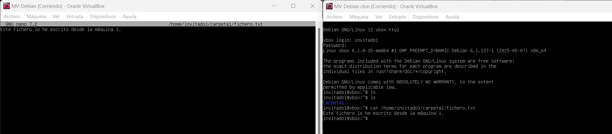
    Por último, siguiendo con la misma disposición de las máquinas que en la captura anterior, como última prueba decidí escribir un archivo .txt desde la máquina 1.

    

## Ejercicio 1.3: Iniciación a Git

Este ejercicio consiste en usar Git como herramienta de control de versiones. Para ello, he llevado a cabo las siguientes tareas: 

### 1. Inicializar un repositorio local. 

Para inicializar el repositorio creé una carpeta en mi escritorio. Después, como se puede ver en la captura, inicialicé un repositorio local en esta carpeta utilizando el comando `git init` desde Git Bash.

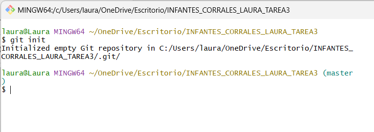

### 2. Enlazar mi repositorio local con GitHub
Para enlazar mi repositorio he seguido los pasos que se indican en el curso de Git de OpenWebinars. Esto quiere decir que primero estuve trabajando con el repositorio a nivel local (practicando los commits) y más tarde lo enlacé con GitHub.

Para enlazarlo, cree un repositorio desde cero desde la web de GitHub con el nombre de "ejercicio 3". Tras crearlo, copié la ruta SSH y, en mi consola, asigné esa ruta a mi repositorio local gracias al comando `git remote set-url`.

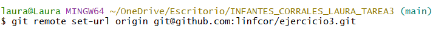

Como ya tenía cambios subidos a mi repositorio, tuve que subir toda esa información con el comando `git push -u origin main`.

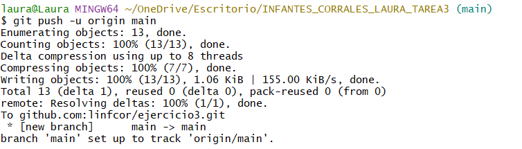

Con esto el repositorio local queda finalmente enlazado a GitHub.

### 3. Realizar commits con mensajes claros

Antes de enlazar mi repositorio local con la nube, estuve practicando como añadir cambios en local. Para ello creé un par de archivos .txt y escribí algunas líneas que luego modifiqué.

Para añadir los cambios utilicé el comando `git add` seguido del fichero que quería añadir los cambios. De esta forma, sus cambios pasaban de estar modificados a staged (esperando a ser guardados). 

Después, hice commit para confirmar y guardar cada cambio con el comando `git commit -m ""` al que además se le puede añadir un mensaje.

Para llevar un registro del estado de mis cambios utilicé el comando `git status` que me ayudó a saber si había algo pendiente de registrar o incluso de confirmar.

Finalmente, con el comando `git log` pude ver un registro de todos los commits que hice.

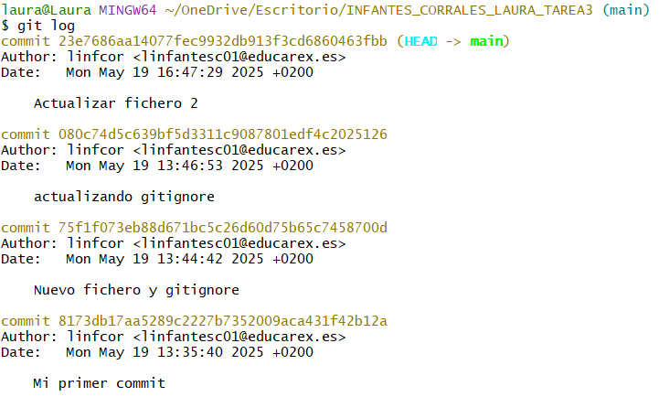

Merece la pena destacar que en el curso de Git aprendí como puedo indicarle a mi repositorio que ignore ciertos documentos gracias al archivo `.gitignore` en el que hice ciertas pruebas. 

### 4. Resolver conflictos 

He practicado como revertir los cambios en caso de conflicto dentro de las distintas áreas (working y staging) con los comandos `git checkout`y `git reset` e incluso he deshecho commits (de tipo soft y hard). Hay que tener mucho cuidado con esto ya que, si se hace de forma descontrolada, puede dar lugar a conflictos. 

En mi ejercicio he decidido hacer varios cambios en un archivo y he revertido el primer commit para que se generara un conflicto. Para solucionarlo se puede hacer de forma manual desde la consola. Simplemente hay que explorar el fichero. Aparecieron unas líneas separando lo que teníamos de lo que hemos revertido. Para escoger borramos lo que no queramos, guardamos y listo.

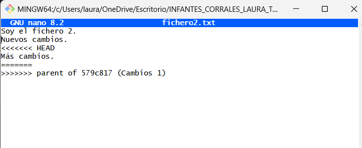

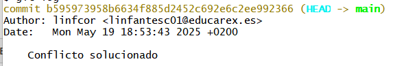

### 5. Crear ramas 

Para mayor claridad he decidido apoyarme en el uso de una interfaz gráfica. En este caso he usado Sourcetree para poder ver las distintas ramas que se iban formando al hacer commits y fusionar unas ramas con otras.

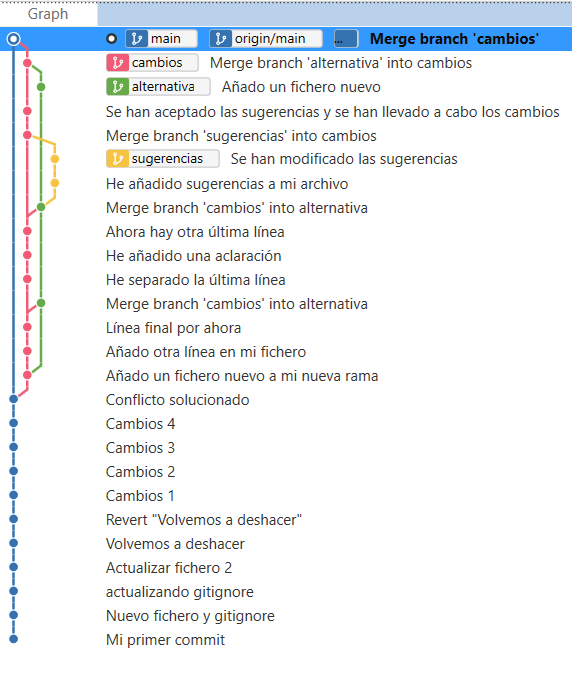

Para crear ramas lo he hecho de dos formas distintas:
* Simplemente con el comando `git branch nombre_rama` y después `git checkout nombre_rama` para posicionarme en dicha rama.
* Con un solo comando: `git checkout -b nombre_rama`. De esta forma, se crea la rama a la vez que nos posiciona en ella.

Como se puede ver en la captura he creado distintas ramas y he trabajado entre ellas. Para fusionar el contenido, he utilizado el comando `git merge --no-ff nombre_rama`. Es muy importante tener en cuenta varios aspectos:
* Hay que situarse en la rama a la que quieres llevar los cambios ANTES de ejecutar git merge
* Para que se cree el commit que ilustra la fusión y podamos ver las distintas ramas en nuestra interfaz gráfica, debemos indicar en el comando que no queremos hacerlo de forma fast-foward