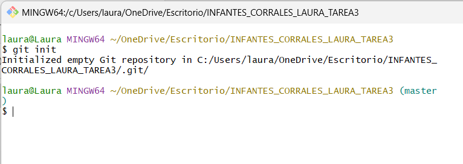
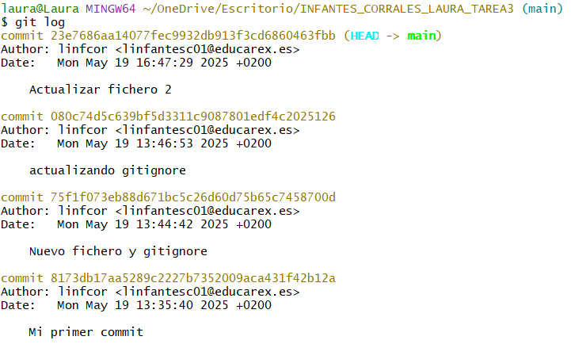
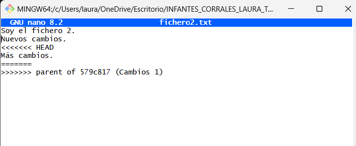
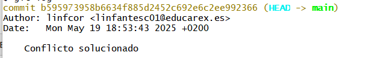
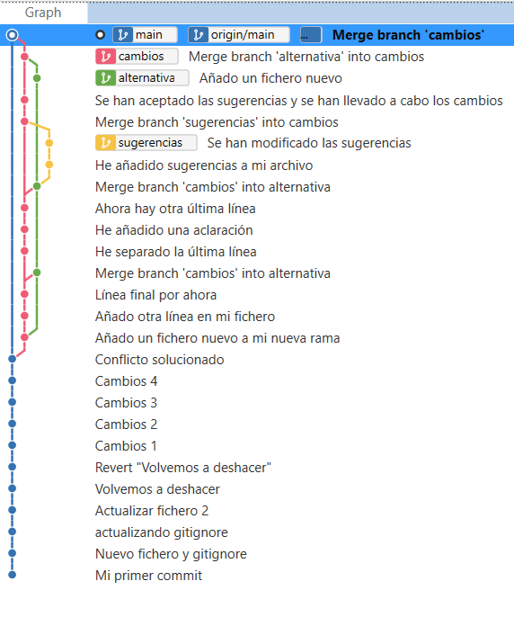

# Ejercicio 1.3: Iniciación a Git

Este ejercicio consiste en usar Git como herramienta de control de versiones. Para ello, he llevado a cabo las siguientes tareas: 

### 1. Inicializar un repositorio local. 

Para inicializar el repositorio creé una carpeta en mi escritorio. Después, como se puede ver en la captura, inicialicé un repositorio local en esta carpeta utilizando el comando `git init` desde Git Bash.

### 2. Enlazar mi repositorio local con GitHub
Para enlazar mi repositorio he seguido los pasos que se indican en el curso de Git de OpenWebinars. Esto quiere decir que primero estuve trabajando con el repositorio a nivel local (practicando los commits) y más tarde lo enlacé con GitHub.

Para enlazarlo, cree un repositorio desde cero desde la web de GitHub con el nombre de "ejercicio 3". Tras crearlo, copié la ruta SSH y, en mi consola, asigné esa ruta a mi repositorio local gracias al comando `git remote set-url`.

Como ya tenía cambios subidos a mi repositorio, tuve que subir toda esa información con el comando `git push -u origin main`.

Con esto el repositorio local queda finalmente enlazado a GitHub.

### 3. Realizar commits con mensajes claros

Antes de enlazar mi repositorio local con la nube, estuve practicando como añadir cambios en local. Para ello creé un par de archivos .txt y escribí algunas líneas que luego modifiqué.

Para añadir los cambios utilicé el comando `git add` seguido del fichero que quería añadir los cambios. De esta forma, sus cambios pasaban de estar modificados a staged (esperando a ser guardados). 

Después, hice commit para confirmar y guardar cada cambio con el comando `git commit -m ""` al que además se le puede añadir un mensaje.

Para llevar un registro del estado de mis cambios utilicé el comando `git status` que me ayudó a saber si había algo pendiente de registrar o incluso de confirmar.

Finalmente, con el comando `git log` pude ver un registro de todos los commits que hice.

Merece la pena destacar que en el curso de Git aprendí como puedo indicarle a mi repositorio que ignore ciertos documentos gracias al archivo `.gitignore` en el que hice ciertas pruebas. 

### 4. Resolver conflictos 

He practicado como revertir los cambios en caso de conflicto dentro de las distintas áreas (working y staging) con los comandos `git checkout`y `git reset` e incluso he deshecho commits (de tipo soft y hard). Hay que tener mucho cuidado con esto ya que, si se hace de forma descontrolada, puede dar lugar a conflictos. 

En mi ejercicio he decidido hacer varios cambios en un archivo y he revertido el primer commit para que se generara un conflicto. Para solucionarlo se puede hacer de forma manual desde la consola. Simplemente hay que explorar el fichero. Aparecieron unas líneas separando lo que teníamos de lo que hemos revertido. Para escoger borramos lo que no queramos, guardamos y listo.

### 5. Crear ramas 

Para mayor claridad he decidido apoyarme en el uso de una interfaz gráfica. En este caso he usado Sourcetree para poder ver las distintas ramas que se iban formando al hacer commits y fusionar unas ramas con otras.

Para crear ramas lo he hecho de dos formas distintas:
* Simplemente con el comando `git branch nombre_rama` y después `git checkout nombre_rama` para posicionarme en dicha rama.
* Con un solo comando: `git checkout -b nombre_rama`. De esta forma, se crea la rama a la vez que nos posiciona en ella.

Como se puede ver en la captura he creado distintas ramas y he trabajado entre ellas. Para fusionar el contenido, he utilizado el comando `git merge --no-ff nombre_rama`. Es muy importante tener en cuenta varios aspectos:
* Hay que situarse en la rama a la que quieres llevar los cambios ANTES de ejecutar git merge
* Para que se cree el commit que ilustra la fusión y podamos ver las distintas ramas en nuestra interfaz gráfica, debemos indicar en el comando que no queremos hacerlo de forma fast-foward